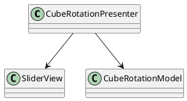

## MVPパターン

```plantuml
@startuml
class CubeRotationPresenter {}
class SliderView {}
class CubeRotationModel {}

CubeRotationPresenter --> SliderView
CubeRotationPresenter --> CubeRotationModel
@enduml
```
